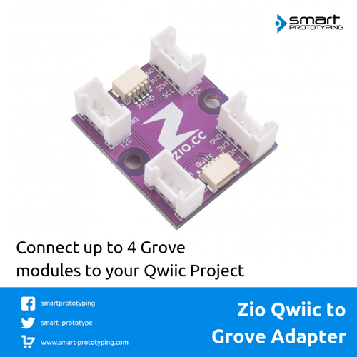

# Qwiic to Grove Adapter

> This product can be available for purchase [here](https://www.smart-prototyping.com/Qwiic-to-Grove-Adapter).

#### Description

There are already lots of I2C grove modules on the market, so it is reasonable to let Gorve and Qwiic modules work together. Here is the adapter that allows you to connect Qwiic module on the one side, and the Grove I2C device on the four Grove connectors. 

> Note: This adapter is only allowed for connecting Grove I2C device on the Grove connector. 

#### Specification

* 2 Qwiic connectors
* 4 Grove connectors (only support I2C device)
* Dimension: 26.2x 30.1mm
* Weight: 3.9g

#### Links

* [PCB Source file and Gerber file](https://github.com/ZIOCC/Qwiic-to-Grove-Adapter)

###### About Zio
> Zio is a new line of open sourced, compact, and grid layout boards, fully integrated for Arduino and Qwiic ecosystem. Designed ideally for wearables, robotics, small-space limitations or other on the go projects. Check out other awesome Zio products [here](https://www.smart-prototyping.com/Zio).
